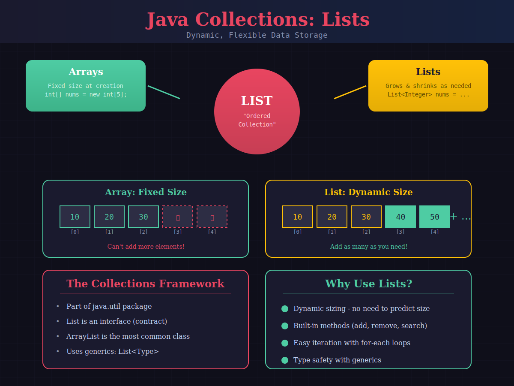
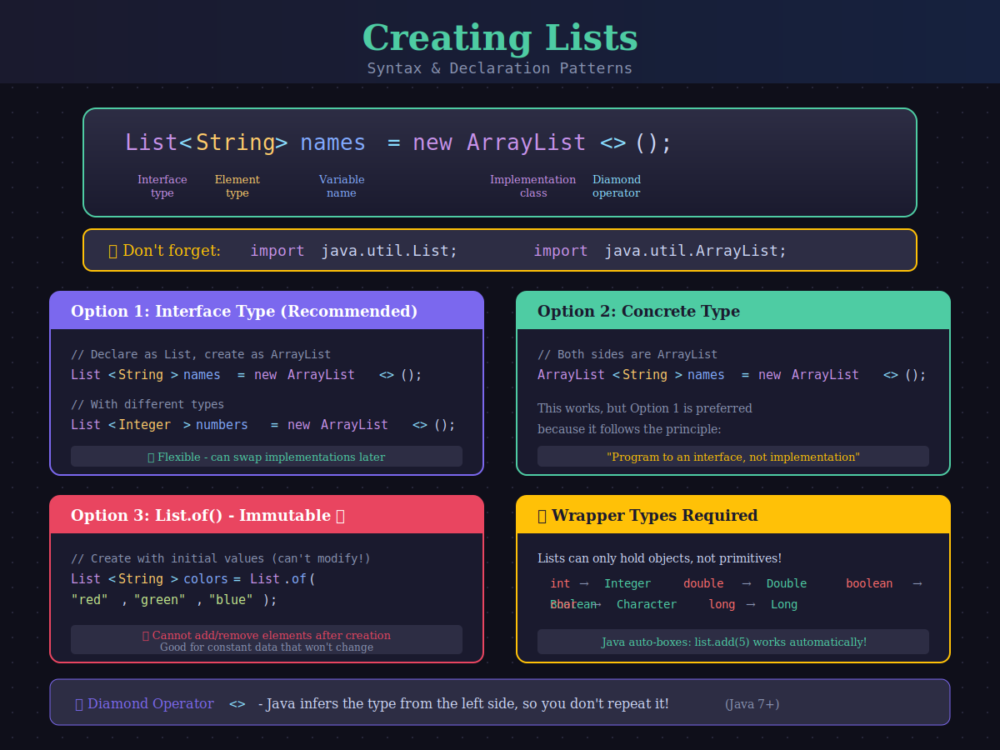
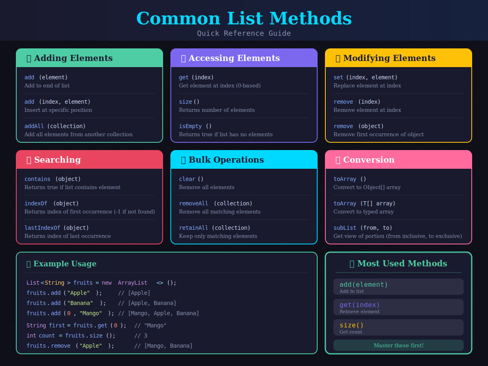
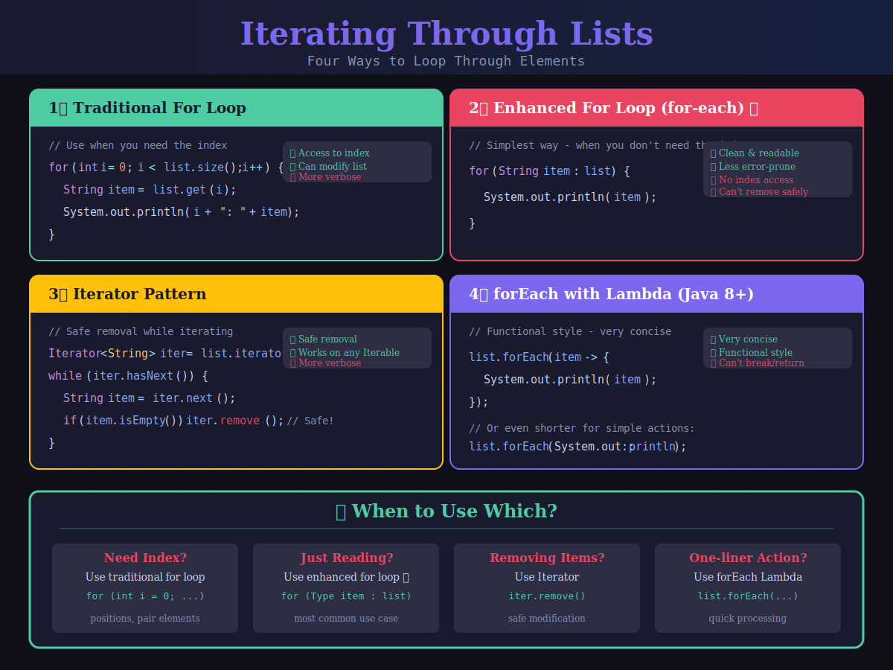
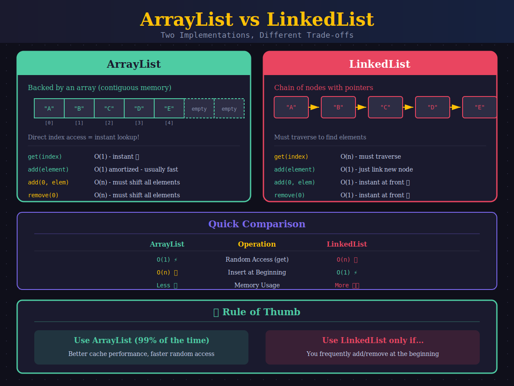
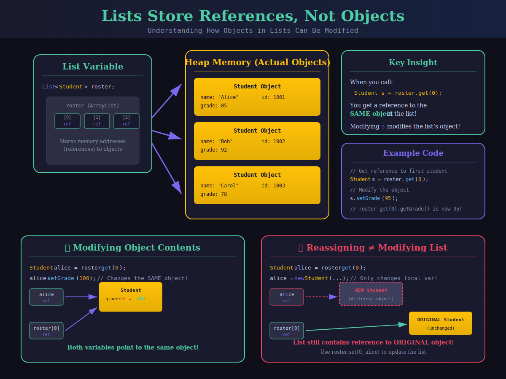

# Java Lists - Guided Notes

> **Java Collections Framework** | Working with Dynamic Arrays

---

## 1. What is a List?



A **List** is an ordered collection that can grow and shrink dynamically. Unlike arrays, you don't need to specify the size upfront.

### Array vs List

| Feature | Array | List |
|---------|-------|------|
| Size | Fixed at creation | Dynamic (grows/shrinks) |
| Syntax | `String[] arr = new String[5];` | `List<String> list = new ArrayList<>();` |
| Add elements | Manual index management | `list.add(element)` |
| Type | Primitive or Object | Object only (use wrappers) |

---

## 2. Creating Lists



### Basic Syntax

```java
import java.util.List;
import java.util.ArrayList;

// Recommended: Declare as interface type
List<String> names = new ArrayList<>();

// Also valid: Declare as concrete type
ArrayList<String> names2 = new ArrayList<>();

// Create with initial values (immutable!)
List<String> colors = List.of("red", "green", "blue");
```

### The Diamond Operator `<>`

Java 7+ lets you omit the type on the right side:

```java
// Before Java 7
List<String> names = new ArrayList<String>();

// Java 7+ (diamond operator)
List<String> names = new ArrayList<>();
```

### ⚠️ Wrapper Types Required

Lists can only hold **objects**, not primitives. Use wrapper classes:

| Primitive | Wrapper |
|-----------|---------|
| `int` | `Integer` |
| `double` | `Double` |
| `boolean` | `Boolean` |
| `char` | `Character` |
| `long` | `Long` |

```java
// Won't compile: List<int> numbers = new ArrayList<>();
List<Integer> numbers = new ArrayList<>();  // ✓ Correct

numbers.add(42);      // Auto-boxing: int → Integer
int n = numbers.get(0);  // Auto-unboxing: Integer → int
```

---

## 3. Common List Methods



### Method Reference Table

| Method | Description | Returns |
|--------|-------------|---------|
| `add(element)` | Add to end | `boolean` |
| `add(index, element)` | Insert at position | `void` |
| `get(index)` | Get element at index | Element |
| `set(index, element)` | Replace element | Old element |
| `remove(index)` | Remove by position | Removed element |
| `remove(object)` | Remove first occurrence | `boolean` |
| `size()` | Number of elements | `int` |
| `isEmpty()` | Check if empty | `boolean` |
| `contains(object)` | Check if present | `boolean` |
| `indexOf(object)` | Find first index | `int` (-1 if not found) |
| `clear()` | Remove all elements | `void` |

### Example Usage

```java
List<String> fruits = new ArrayList<>();

// Adding
fruits.add("Apple");           // [Apple]
fruits.add("Banana");          // [Apple, Banana]
fruits.add(1, "Orange");       // [Apple, Orange, Banana]

// Accessing
String first = fruits.get(0);  // "Apple"
int count = fruits.size();     // 3

// Modifying
fruits.set(0, "Mango");        // [Mango, Orange, Banana]
fruits.remove("Orange");       // [Mango, Banana]

// Searching
boolean hasMango = fruits.contains("Mango");  // true
int index = fruits.indexOf("Banana");         // 1
```

> 💡 **Most Used Methods:** `add(element)`, `get(index)`, `size()`

---

## 4. Iterating Through Lists



### Method 1: Traditional For Loop
*Use when you need the index*

```java
List<String> names = List.of("Alice", "Bob", "Carol");

for (int i = 0; i < names.size(); i++) {
    System.out.println(i + ": " + names.get(i));
}
// Output: 0: Alice, 1: Bob, 2: Carol
```

### Method 2: Enhanced For Loop ⭐
*Recommended for most cases*

```java
for (String name : names) {
    System.out.println(name);
}
// Output: Alice, Bob, Carol
```

### Method 3: Iterator
*Safe for removal while iterating*

```java
List<String> mutableList = new ArrayList<>(List.of("A", "", "B", ""));

Iterator<String> iter = mutableList.iterator();
while (iter.hasNext()) {
    String item = iter.next();
    if (item.isEmpty()) {
        iter.remove();  // Safe to remove!
    }
}
// mutableList is now [A, B]
```

### Method 4: forEach with Lambda (Java 8+)

```java
names.forEach(name -> System.out.println(name));

// Or with method reference:
names.forEach(System.out::println);
```

> ⚠️ **Warning:** Using `list.remove()` inside a for-each loop causes `ConcurrentModificationException`! Use an Iterator instead.

---

## 5. ArrayList vs LinkedList



### Performance Comparison

| Operation | ArrayList | LinkedList |
|-----------|-----------|------------|
| `get(index)` | O(1) ✓ Fast | O(n) Slow |
| `add(element)` at end | O(1)* | O(1) |
| `add(0, element)` at start | O(n) Slow | O(1) ✓ Fast |
| `remove(0)` at start | O(n) Slow | O(1) ✓ Fast |
| Memory | Compact | Extra overhead |

*\* Amortized - occasionally needs to resize*

### When to Use Which?

✅ **Use ArrayList (99% of cases)**
- Fast random access O(1)
- Better memory efficiency
- Better CPU cache performance

⚠️ **Use LinkedList only if...**
- Frequent add/remove at beginning
- Need Queue/Deque operations
- Very large lists with lots of insertions

```java
// Both implement List - same interface!
List<String> arrayList = new ArrayList<>();
List<String> linkedList = new LinkedList<>();

// Same methods work on both!
arrayList.add("Hello");
linkedList.add("Hello");
```

---

## 6. Lists Store References, Not Copies



When you store an object in a List, the List holds a **reference** (memory address) to that object—not a copy! This means if you modify the object, the change is visible through the List too.

### Example: Modifying Objects Through References

```java
List<Student> roster = new ArrayList<>();
roster.add(new Student("Alice", 85));

// Get a reference to the first student
Student s = roster.get(0);

// Modify through the reference
s.setGrade(95);

// The change is reflected in the list!
System.out.println(roster.get(0).getGrade()); // Prints: 95
```

### ✓ This DOES Modify the List's Object

```java
Student s = roster.get(0);
s.setGrade(95);  // Changes the actual object in the list!
```

### ✗ This Does NOT Modify the List

```java
Student s = roster.get(0);
s = new Student(...);  // Only changes local variable s!
// The list still contains the original object
```

> 💡 To replace an object in the list, use `roster.set(0, newStudent)`

---

## 🧪 Try It: Build a Shopping List

Practice using List methods:

```java
import java.util.List;
import java.util.ArrayList;

public class ShoppingList {
    public static void main(String[] args) {
        // 1. Create an empty ArrayList of Strings
        List<String> shopping = new ArrayList<>();
        
        // 2. Add these items: "Milk", "Eggs", "Bread"
        shopping.add("Milk");
        shopping.add("Eggs");
        shopping.add("Bread");
        
        // 3. Print the size of the list
        System.out.println("Items: " + shopping.size());
        
        // 4. Insert "Butter" at the beginning (index 0)
        shopping.add(0, "Butter");
        
        // 5. Check if "Eggs" is in the list
        if (shopping.contains("Eggs")) {
            System.out.println("Eggs is on the list!");
        }
        
        // 6. Print all items using enhanced for loop
        System.out.println("\nShopping List:");
        for (String item : shopping) {
            System.out.println("- " + item);
        }
        
        // 7. Remove "Bread" from the list
        shopping.remove("Bread");
        
        // 8. Print final list
        System.out.println("\nFinal list: " + shopping);
    }
}
```

---

## 📝 Key Takeaways

1. **Use `List<Type>` interface** for variable declarations, `ArrayList` for instantiation
2. **Import both** `java.util.List` and `java.util.ArrayList`
3. **Use wrapper classes** for primitives (`Integer`, `Double`, etc.)
4. **Enhanced for loop** is best for most iteration needs
5. **Use Iterator** when removing elements while iterating
6. **ArrayList is the default choice** - use it unless you have a specific reason not to
7. **Lists store references** - modifying an object affects what's "in" the list

---

## Quick Reference

```java
// Creating
List<String> list = new ArrayList<>();
List<String> list = new ArrayList<>(List.of("a", "b", "c"));

// Adding
list.add("item");
list.add(0, "first");

// Accessing
String item = list.get(0);
int size = list.size();
boolean empty = list.isEmpty();

// Searching
boolean found = list.contains("item");
int index = list.indexOf("item");

// Modifying
list.set(0, "new");
list.remove(0);
list.remove("item");
list.clear();

// Iterating
for (String s : list) { }
for (int i = 0; i < list.size(); i++) { }
list.forEach(s -> System.out.println(s));
```
